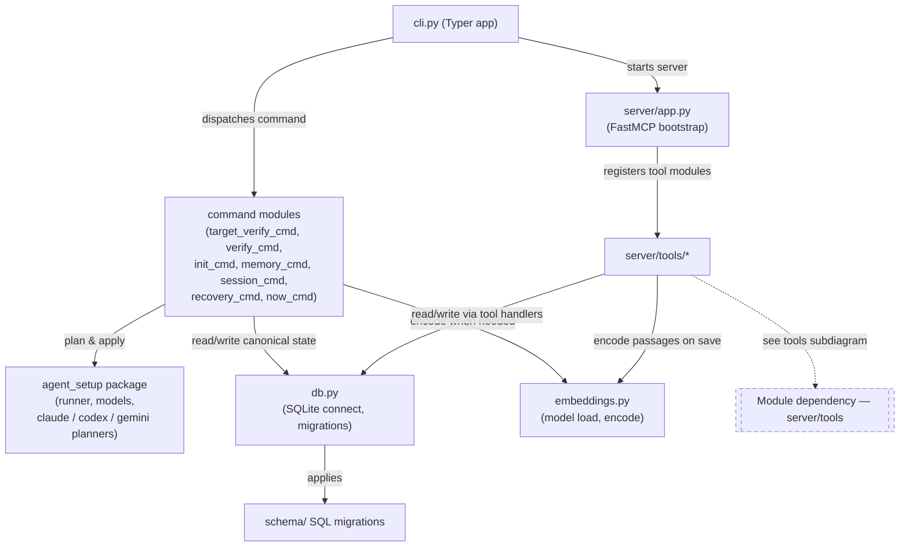
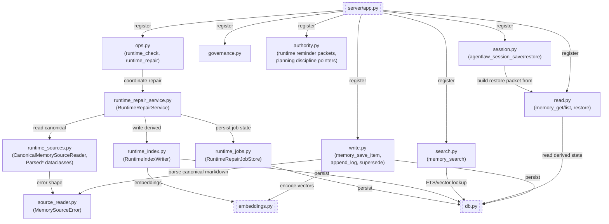
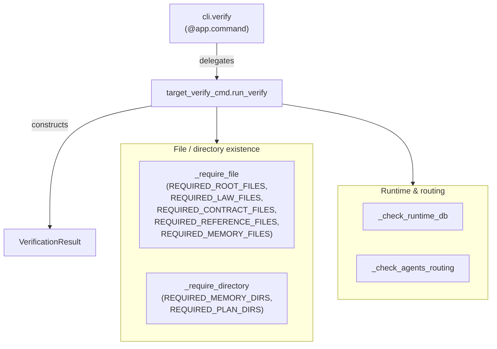
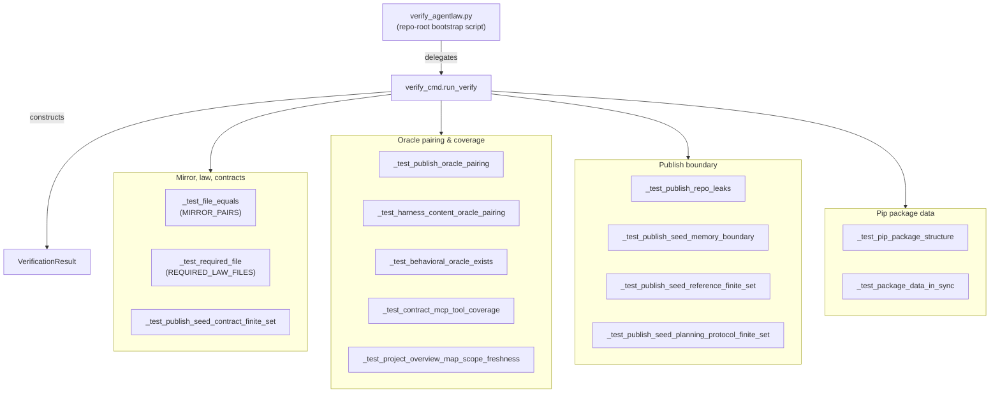
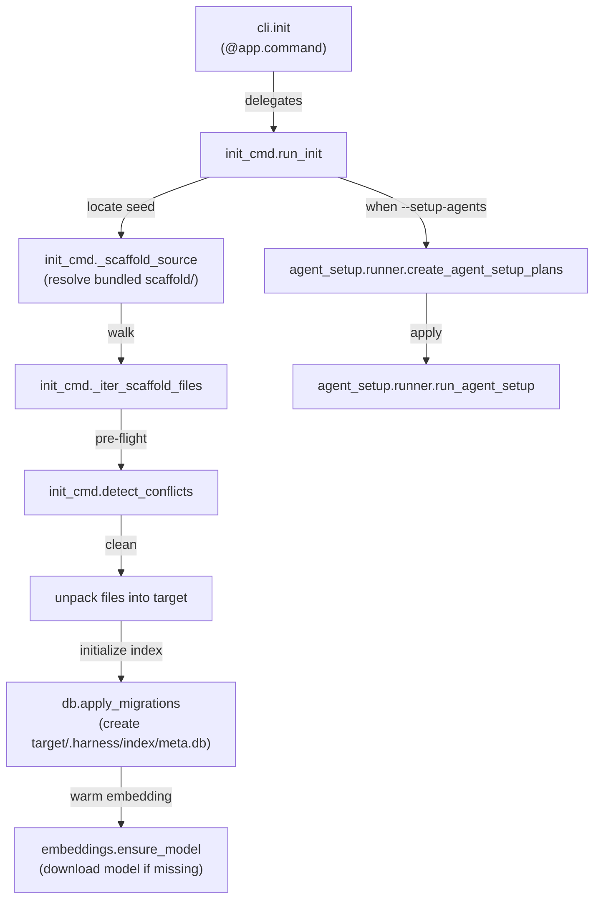
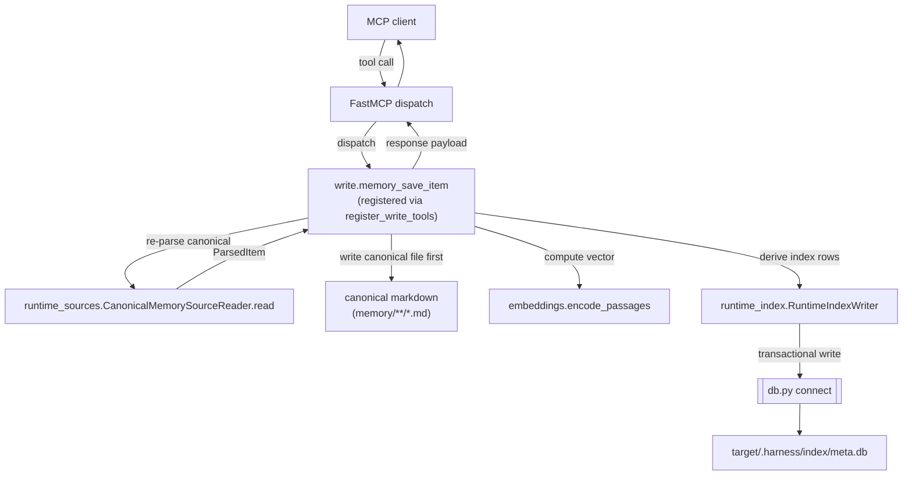
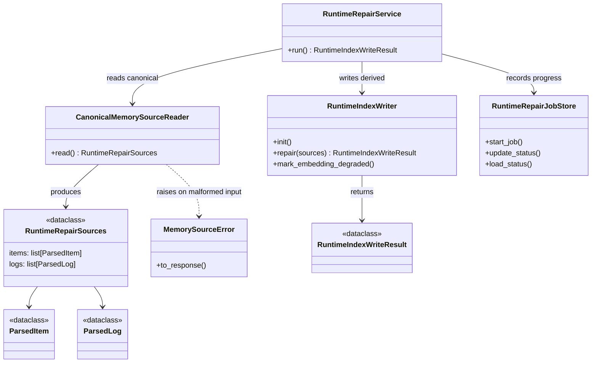

# Project Overview

_Role boundary: reference-layer orientation for this project. Scope/non-scope lives in `docs/law/SCOPE.md`, routing in `AGENTS.md`, installation and usage in `README.md`._

## What this is

`agentlaw` is an installable governance scaffold and memory MCP server for AI coding agents. This repository is the authoring workspace that produces the pip package and the canonical scaffold under `publish-repo/*` that downstream target projects unpack via `agentlaw init`.

It implements the principles from OpenAI's harness engineering technical article (https://openai.com/index/harness-engineering/). A Korean translation of the article is stored locally at `references/하네스 엔지니어링_ 에이전트 우선 세계에서 Codex 활용하기 _ OpenAI.pdf`.

## Why it exists

AI coding agents in a repository need shared law, shared memory continuity, and a shared execution entry point so that their behavior is reviewable rather than improvised per session. `agentlaw` packages those pieces — constitution, law, root tools, memory runtime, verification — as a reusable, auditable kit that can be installed into any project and recursively improved.

This workspace's own goals:

- Build the `agentlaw` pip/pipx package that distributes the governance scaffold and runs the memory MCP server.
- Maintain the canonical scaffold contents under `publish-repo/*`.
- Use the kit's own product to govern this workspace (recursive improvement).
- Iterate the shared kit until installation, bootstrap, and memory operation reliably produce a fully localized harness inside any target repository.

## Audience

- **Target-project users**: install the pip package into their own repository to get a harness-governed workspace with memory continuity and an MCP server.
- **Harness-kit contributors**: work inside this authoring repository to improve law, scaffold, package code, and the memory runtime.
- **AI coding agents**: read the law layer (`docs/law/*`) and this file for orientation; operate through the MCP server or CLI surfaces.

## Project-specific additions to the standard Harness layout

Because `agentlaw` is the project that builds the harness itself, this repository has directories and files that do **not** exist in a typical harness-governed target project. They must not be conflated with the default harness layout defined in `docs/law/REPOSITORY_ARTIFACT_RULES.md`.

| Top-level path | Role | Lives only in this authoring repo? | Distributed to target on `init`? |
| --- | --- | --- | --- |
| `AGENTLAW_CONSTITUTION.md`, `HARNESS_*_TOOL.md`, `AGENTS.md` (root) | Local authoring copies; mirrored from `publish-repo/` | No (publish-repo holds the canonical version) | Yes (via publish-repo unpack) |
| `docs/law/*` | Local authoring law (may diverge from publish-repo seed) | No (publish-repo holds the generalized version) | Yes (publish-repo seed unpacks) |
| `publish-repo/*` | Canonical distribution scaffold; bundled into pip package | Yes (this directory is the seed) | Yes (entire contents unpack into target root) |
| `src/agentlaw/` | Python source for the pip package itself (CLI, MCP server, schema, scaffold-bundling) | **Yes — never appears in target repos** | No |
| `plans/active/`, `plans/completed/`, `plans/tech-debt-tracker.md` | Local authoring workflow state | Yes (publish-repo's plans/ is empty starter) | No |
| `references/*` | Local authoring reference notes, design drafts, PDFs | Yes (publish-repo's references/ has only generic seeds) | No |
| `memory/*` | Local authoring memory | Yes (publish-repo's memory/ has starter-safe seeds only) | No |
| `verify_agentlaw.py` | Pre-install workspace integrity check | Yes — authoring-repo entry point | No |
| `sync_package_data.py` | Developer script that snapshots `publish-repo/*` into `src/agentlaw/scaffold/` and `references/agentlaw-memory-schema.sql` into `src/agentlaw/schema/v001_initial.sql` so the pip package carries current canonical content | Yes — authoring-repo dev tool only | No |

Notes that have caused agent confusion in the past:

- **`memory/` and `.harness/` are different layers.** `memory/*` is canonical human-reviewable markdown; `.harness/*` is derived runtime/index state created by the pip package. The DB lives in `.harness/index/meta.db`, not in `memory/`. Keeping them in separate directories preserves the authority boundary (markdown is source-of-truth, DB is a derived index rebuildable from markdown) and keeps `.gitignore` simple (`.harness/` ignored, `memory/` tracked).
- **`src/` does not appear in target projects.** Python package source lives only in this authoring repo. Pipx installs the package into the user's isolated venv; target projects only receive scaffold contents via unpack.
- **`publish-repo/` is distribution target only.** Recursive-improvement work happens in the authoring repo's `docs/law/*`, `plans/active/*`, etc. Stable results get propagated into `publish-repo/` so the next pip release distributes them.

## Code architecture map

_Obligation: see `docs/law/CODE_AUTHORSHIP_AND_STEWARDSHIP_RULES.md` "Code Architecture Map"._

**Slot-selection rationale.** The `agentlaw` source tree is dominated by procedural Typer commands and FastMCP tool-registration functions — 33 Python files, 11 classes, most of which are `@dataclass` data holders. Only the runtime-repair subsystem carries real object-oriented collaboration. The map therefore uses: **Module dependency** (structural, whole codebase, split via boundary nodes to respect the density cap), **Entry-point call graph** (flow, one subdiagram per top-level user-visible entry point), and a small **Class diagram** (structural, runtime-repair subsystem only). State and data-flow slots are omitted — this codebase has no lifecycle-heavy subsystem and no transformation pipeline that is not already captured by the call-graph slot.

This map also serves as the freshness anchor for the verifier's Layer 2 enforcement (`_test_project_overview_map_scope_freshness` in `verify_cmd.py`): the check compares each scoped file's most recent git commit timestamp against this file's most recent commit timestamp, so any structural change within `Map scope:` should be committed alongside the diagram update it implies. An acknowledgment fast-path PASSes when this file has uncommitted local modifications, so the developer's pre-commit retouch workflow (edit scoped file → edit overview → verify → commit) stays available without weakening the post-commit constraint.

A sibling verifier subsystem `_test_plan_coverage_for_changes` enforces plan coverage at the same baseline (`pyproject.toml` version-bump SHA): every non-trivial-surface file modified since the bump must be listed as a backticked path inside the indented children of an active or recently-completed plan's `- **Affected surfaces**:` bullet (parseable format defined in `docs/law/REPOSITORY_ARTIFACT_RULES.md` § Active Plan Preflight Fields). The parser stops at the first sibling top-level bullet (`- **Public contract impact**:` and the like), so backticks mentioned in other preflight fields do not silently confer coverage. The check shares the freshness layer's git-baseline machinery and runs alongside it inside `run_verify`.

The `agent_setup` package remains represented as one module-dependency node because host-specific registration planners still collaborate only through `runner.py` and shared setup models. Adapter-internal command-shape changes, such as Codex cwd-based MCP registration, do not add a new cross-module dependency or a new entry-point flow.

**Map scope:**
- `src/agentlaw/**/*.py`

### Module dependency — top cluster

Boundary nodes (dashed) refer to other diagrams. Edge labels describe the relationship.



### Module dependency — server/tools



### Entry-point call graph — `agentlaw verify`

The CLI `verify` command checks that a target project's scaffolded layout is intact: required root / law / contract / reference / memory files and directories, the runtime index DB, and AGENTS.md routing. The checks are existence-only and runtime-shape; per `docs/law/STARTER_SPECIALIZATION_RULES.md` target projects legitimately diverge in content, so strict hash-match is intentionally not enforced.

Authoring-workspace release-readiness checks (mirror integrity, oracle pairing, scaffold/publish-repo sync, MCP tool coverage, code architecture map freshness) live in `verify_cmd.run_verify` and are reached via `python verify_agentlaw.py` from the authoring-repo root or pytest, not through the public CLI.



Authoring-side verifier (reached only via `python verify_agentlaw.py`):



### Entry-point call graph — `agentlaw init`



### Entry-point call graph — MCP tool dispatch (`memory_save_item` exemplar)

The same pattern applies to other write tools (`memory_append_log`, `memory_supersede`, `memory_set_status`).



### Class diagram — runtime-repair subsystem



### Node index

Primary-home diagram for each module / class. Boundary-node occurrences are not listed.

| Symbol | Primary-home diagram |
| --- | --- |
| `cli.py`, `__main__.py`, command modules | Module dependency — top cluster |
| `agent_setup/*`, `db.py`, `embeddings.py`, `schema/*` | Module dependency — top cluster |
| `server/app.py` | Module dependency — top cluster |
| `server/tools/*` modules | Module dependency — server/tools |
| `target_verify_cmd` check functions | Entry-point call graph — `agentlaw verify` |
| `verify_cmd` check functions | Entry-point call graph — `agentlaw verify` (authoring-side sub-diagram) |
| `init_cmd` helpers | Entry-point call graph — `agentlaw init` |
| `memory_save_item` dispatch path | Entry-point call graph — MCP tool dispatch |
| `RuntimeRepairService`, `RuntimeIndexWriter`, `RuntimeRepairJobStore`, `CanonicalMemorySourceReader`, `MemorySourceError`, `RuntimeRepairSources`, `ParsedItem`, `ParsedLog`, `RuntimeIndexWriteResult` | Class diagram — runtime-repair subsystem |

## Data / state model

The harness memory subsystem separates canonical source (human-reviewable Markdown) from derived index state (rebuildable from Markdown):

```text
memory/                             # canonical source (authority level 4)
  working-set.md
  LOOKUP_RULES.md
  preferences.md
  known-facts/*.md
  logs/YYYY-MM/YYYY-MM-DD.md
          |
          | runtime repair reads & re-derives
          v
.harness/                           # derived runtime state (authority level 5, rebuildable)
  index/
    meta.db                         # SQLite + FTS5 + sqlite-vec
  models/
    embedding/multilingual-e5-small/
```

## Typical flows

### Target project bootstrap

```text
pipx install agentlaw
 -> agentlaw init <target>
      -> unpack publish-repo/* into target
      -> create target/.harness/index/meta.db (apply schema migrations)
      -> download embedding model into target/.harness/models/
```

### Session restore (no MCP available)

```text
agentlaw session-restore --target .
 -> read memory/working-set.md
 -> read memory/LOOKUP_RULES.md (if needed)
 -> emit restore packet (JSON or text)
```

### Runtime repair (re-derive index from canonical Markdown)

```text
agentlaw memory-runtime-repair --target .
 -> parse memory/known-facts/*.md and memory/logs/**/*.md
 -> replace .harness/index/meta.db rows for the scope
 -> regenerate item vector embeddings (logs are chunked but not embedded in V1)
```

### Three root tools — distinct roles

| Tool | When to use |
| --- | --- |
| `AGENTLAW_INIT_TOOL.md` | First-time setup. Agent classifies the target repo and generates the localized law layer. |
| `AGENTLAW_UPDATE_TOOL.md` | Incorporate upstream changes. Merges new shared requirements into existing localized law without losing local facts. The Full Update Cycle, Responsibility Split, Failure Modes, and Non-Pip Distribution sections are inside `AGENTLAW_UPDATE_TOOL.md` itself. |
| `AGENTLAW_FIX_TOOL.md` | Fix local drift. Adds the smallest sufficient correction at the right layer when agents escape harness rules. |

`AGENTLAW_UPDATE_TOOL.md` is the primary update mechanism; `pipx upgrade agentlaw` is infrastructure-level support that delivers the new bundled scaffold and applies binary schema migrations. The LLM-driven merge step cannot be skipped.

### Recursive improvement cycle

1. Use the kit (constitution + 3 tools + law layer) to govern this workspace's own work.
2. Use real authoring/usage experience and `references/*` materials to identify improvements.
3. Capture decisions in `plans/active/*`, refine in `references/*` drafts, then promote into `docs/law/*` law (root + publish-repo mirror).
4. Update `src/agentlaw/` Python source when implementation needs to track new contracts.
5. Sync `publish-repo/*` to reflect the improved law and scaffold contents (root mirror checks via `agentlaw verify`).
6. Cut a new pip package release; users get improvements via `pipx upgrade agentlaw` + `AGENTLAW_UPDATE_TOOL.md`.
7. This workspace now runs on the improved version — repeat.

`publish-repo/*` is the destination of distribution, not a workspace for recursive improvement. Improvement loops happen in this authoring repo; results flow into `publish-repo/`.
